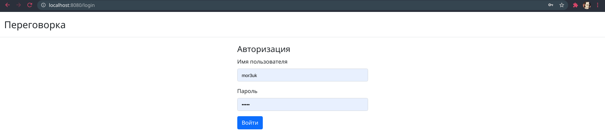
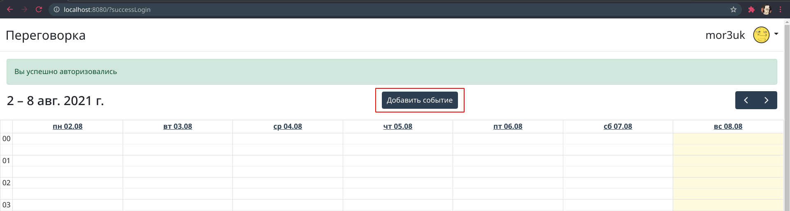
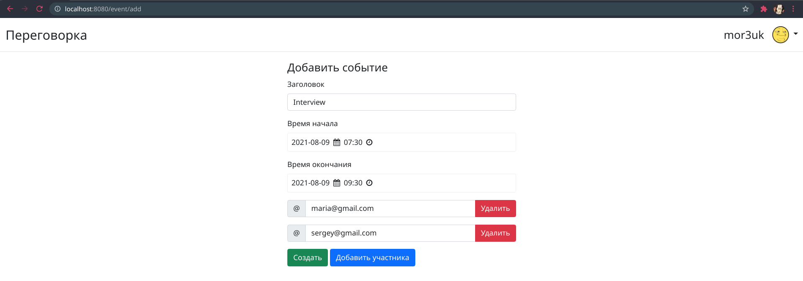
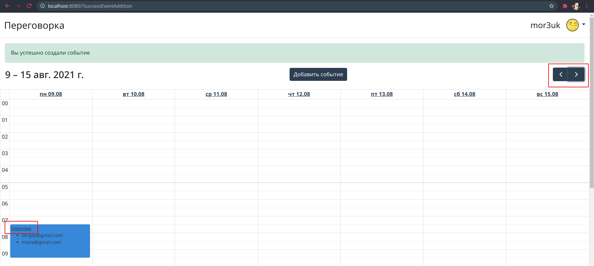
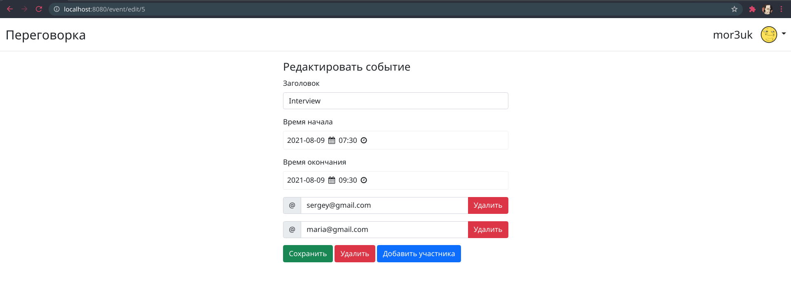
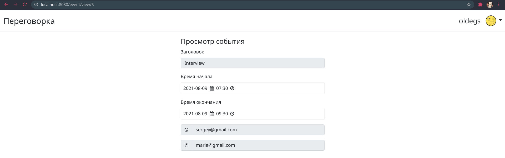
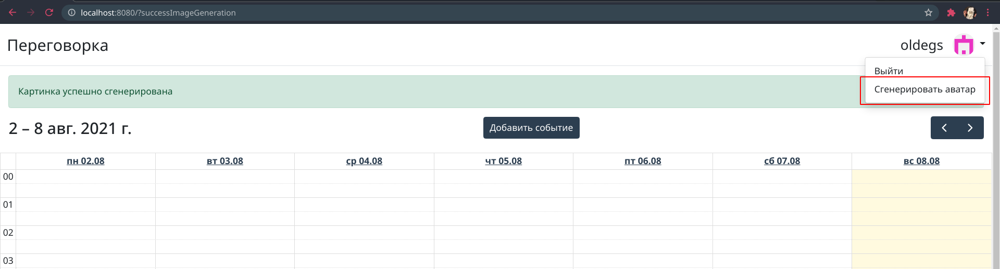

# Описание приложения

### Авторизация

Чтобы воспользоваться возможностью бронировать переговорку, необходимо пройти авторизацию.

### Добавление события

Создать событие для переговорки можно нажав по кнопке 'Добавить событие'.

На странице создания события можно указать его заголовок, время начала и окончания, а так же указать почтовые адреса участников, если необходимо.

### Навигация и редактирование события

Для перелистывания недель используются кнопки в правом верхнем углу. Чтобы отредактировать событие, нужно кликнуть по заголовку.

На странице редактирования события можно поменять любые данные, сохраненные при создании, а так же удалить событие.

### Просмотр события

Если событие было создано другим пользователем, то есть возможность перейти на его детальную страницу по клику на заголовок, но без возможности редактировать.

### Генерация аватарки

При желании можно сгенерировать аватарку, нажав на кнопку из выпадающего списка, делать это можно не однократно.

