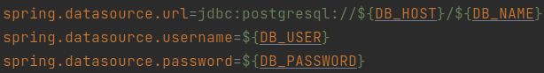
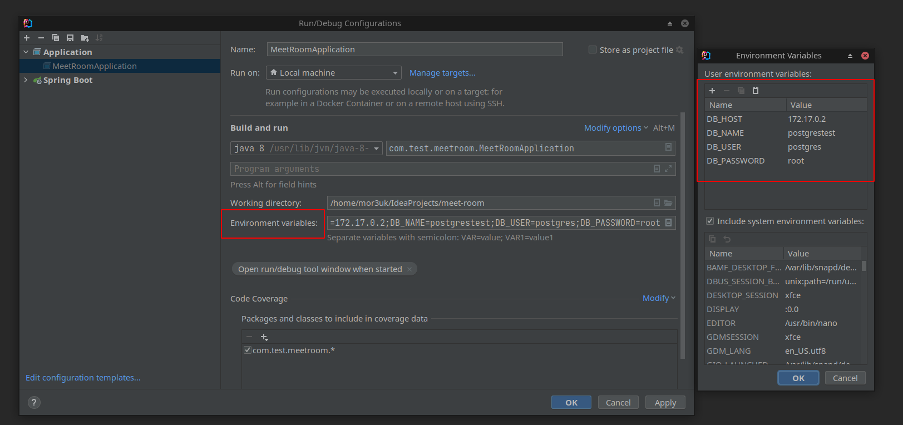

# Запуск приложения

### Системные требования

- Java 8
- PostgreSQL 13.3

### Запуск

- Создать базу данных.
- Импортировать в нее [дамп](../dmp/postgres.sql.tar), в котором содержатся все необходимые таблицы, а так же 2 пользователя для тестирования приложения.
- Установить переменные окружения, которые используются при подключении к базе данных.



- При запуске через консоль нужно создать файл .env, записать в него переменные и экспортировать их: ```export $(cat .env | xargs)```
- При запуске с помощью IDEA переменные можно задать в конфигурации запуска:



- Запустить команду: ```./mvnw spring-boot:run```
- Приложение доступно по адресу: http://localhost:8080/

### Данные пользователей для авторизации

Имя пользователя | Пароль
--- | ---
mor3uk | 12345
oldegs | qwerty